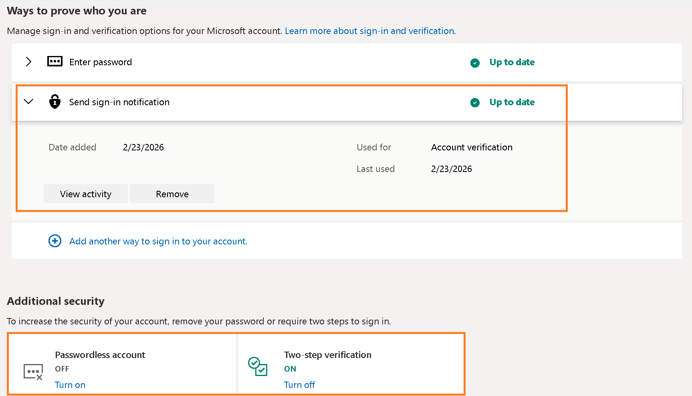
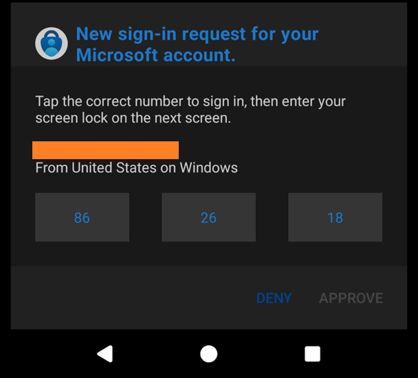

# :warning:MFA fatigue risk on Microsoft Personal accounts actively being exploited when Authenticator sign‑in notifications are enabled allows full account takeover
**Who this is for:** Anyone with a Microsoft Personal account (MSA).  
**MSRC case:** VULN-172417. Microsoft is aware this write‑up exists.

---

## The short version
I started getting Microsoft Authenticator prompts that I did **not** request. After looking into it, I found that enabling **Authenticator sign‑in notifications** can make it possible to sign in **without typing the password first**, even when the account UI shows:

- **Passwordless: OFF**
- **Two‑step verification: ON**

**Impact:** A single accidental approval can be enough to create a session capable of high‑risk security changes, resulting in **full account takeover**.

Once Authenticator sign‑in notifications **are** enabled, they can bypass **password entry** and the UI offers no option to disable them.  
  
That’s a problem because if someone keeps spamming sign‑in attempts, all it takes is **one accidental approval**.
> This behavior appears to have been reported for several years, but I only started seeing it in **January 2026**, so I didn’t notice earlier discussions. Below is a dated list of related write‑ups (focused on consumer/personal Microsoft accounts). See **[Related Reports](#related-reports)**

---

## My story (how this started)
- At first, I got 1–2 unexpected Authenticator prompts per day.
- I ignored it.
- One morning I got two prompts back‑to‑back, clearly not from any device I own.
- I reset my password immediately.
- I still got another prompt after the password reset.
- At that point it didn’t look like “someone knows my password”, it looked like someone was trying to wear me down until I approved a prompt.
- I then tested sign‑in from a fresh browser session and from a device I don’t normally use. I expected to be forced to type my password first (because **Passwordless was OFF**), but a sign‑in notification approval path was the only authentication factor.
- I asked a few friends in different countries/continents to check if they were seeing the same kind of unexpected prompts. Multiple people said yes.
- That’s when I opened an MSRC case (VULN‑172417).

---

## How to recognise you’re using a **Personal Microsoft account (MSA)**

You’re *typically* on a **personal Microsoft account (MSA)** if you sign in via **Outlook.com** using a Microsoft account username + password (rather than an organisation “work/school” sign-in).

A quick giveaway is the email domain on the account. Common consumer (MSA) mailbox domains include:
- **@outlook.com**
- **@hotmail.com**
- **@live.com**
- **@msn.com**

International Outlook consumer domains use these extensions:  
.com.ar, .com.au, .at, .be, .com.br, .cl, .cz, .dk, .fr, .de, .com.gr, .co.il, .in, .co.id, .ie, .it, .hu, .jp, .kr, .lv, .my, .nl, .co.nz, .com.pe, .ph, .pt, .sa, .sg, .sk, .es, .co.th, .com.tr, .com.vn

---

## Evidence

### Unrequested prompt with location mismatch
The screenshot below shows an Authenticator prompt I did not initiate. The text visible in the prompt includes:
- “New sign‑in request for your Microsoft account.”
- “From **United States** on Windows”

I’m not in the United States and I was not using a Windows device at the time.

---

## What I observed

### 1) Passwordless is OFF, but sign‑in notifications still behave like passwordless
Even when the Microsoft account UI shows **Passwordless account: OFF**, the sign‑in flow will offer **Send notification** as the primary alternative to password entry, with “Use your password” shown as an alternate option rather than a requirement.

**Microsoft documentation:**
- Sign in using Microsoft Authenticator (describes “Send notification” / approvals as a sign‑in path):  
  https://support.microsoft.com/en-us/account-billing/sign-in-using-microsoft-authenticator-582bdc07-4566-4c97-a7aa-56058122714c  
  This document clearly states, and I quote:
  > If you have turned on passwordless
- How to go passwordless with your Microsoft account (describes passwordless as a distinct mode):  
  https://support.microsoft.com/en-us/account-billing/how-to-go-passwordless-with-your-microsoft-account-674ce301-3574-4387-a93d-916751764c43

**Doesn’t match:** “Passwordless: OFF” suggests passwordless-style sign-in shouldn’t be the default path, but notification‑first sign‑in is still offered.

---

### 2) Two‑step verification is ON, but the password can be skipped
Two‑step verification is generally understood as using **two different factor types**:
- something you **know** (password)
- something you **have** (phone/app/code)
- something you **are** (biometrics)

Microsoft’s Two‑step verification page describes it as requiring **two different forms of identity**, specifically your **password** plus a second method. It also states you will “always need two forms of identification” when it’s enabled.

But the observed sign‑in flow can complete with a sign‑in notification approval **without entering the password**, a single factor that falls under “something you have” even though Two‑step verification is enabled.  
Microsoft appears to treat the phone’s local unlock (PIN/biometric) as “good enough” in place of a password.

**Microsoft documentation:**
- How to use two-step verification with your Microsoft account:  
  https://support.microsoft.com/en-us/account-billing/how-to-use-two-step-verification-with-your-microsoft-account-c7910146-672f-01e9-50a0-93b4585e7eb4  
  This document clearly states, and I quote:
  > It uses two different forms of identity: your password, and a contact method

**Doesn’t match:** “Two‑step verification: ON” two-steps during sign-in, but the observed flow can allow sign‑in one notification approval.

---

### 3) One approved sign‑in notification can lead to high‑impact account changes
After approving a sign‑in notifications, the resulting session can reach account security areas and start **high‑risk changes** (like changing sign‑in methods or password/security changes) without a second authorisation check.

I’m not publishing exploitation instructions here. MSRC has been informed.

---

### 4) Cloud Backup can bring sign‑in notifications back
I removed sign‑in notification approvals and switched to a code‑based authenticator flow (password + 6‑digit code). That fixed the immediate issue.

Later, after enabling **Authenticator Cloud Backup**, sign‑in notifications was reintroduced, putting the account back into the same MFA‑fatigue exposure.

**Microsoft documentation:**
- Back up your accounts in Microsoft Authenticator:  
  https://support.microsoft.com/en-us/account-billing/back-up-your-accounts-in-microsoft-authenticator-bb939936-7a8d-4e88-bc43-49bc1a700a40

**Doesn’t match:** Cloud Backup is a normal device-migration feature, but forcefully reintroduces sign‑in notifications even after you removed it.

Workaround provided here: **[Workaround (user‑side)](#workaround-userside)**

---

## Why this matters
Sign‑in notification prompts are easy to spam. Humans are not perfect. If someone gets enough prompts, eventually one gets approved by mistake.

One approval is enough to create a session that can change all sign‑in methods including passwords, this leads to full account takeover.

---

## Workaround (user‑side)
If you want to keep Authenticator Cloud Backup but avoid sign‑in notification approvals being used for sign‑in, you can switch to **password + 6‑digit code**.

See the How‑To: **[How-To](How-To)**

---

## Microsoft coordination
- MSRC submission: **VULN-172417**
- MSRC case number: **108284**
- I shared a draft of this write-up with MSRC on **24 February 2026** and delayed publication after Microsoft asked for additional review time.
- On **9 March 2026**, MSRC replied that the finding is **valid** but **does not meet Microsoft’s bar for immediate servicing**.
- This repository is being disclosed on **10 March 2026** after that review period and response.

---

## Related reports
The core behavior documented in this repo (notification approvals acting like a primary sign‑in path) appears in multiple public writeups over time.

### 2021‑09‑03 - Microsoft Q&A: “Turn off passwordless sign‑in … use as a code authenticator”
Link: https://learn.microsoft.com/en-us/answers/questions/216956/turn-off-passwordless-sign-in-on-microsoft-authent
- **Problem:** Users want Microsoft Authenticator to behave like classic 2‑step verification (**password + code**) instead of “phone sign‑in” / approval prompts.
- **Conclusion / workaround (community‑reported, Android):** Remove the account from Authenticator, temporarily remove device screen lock, re‑add the account, and select **“Enable 2‑factor verification”** (not **“Enable phone sign‑in”**).

### 2022‑05‑01 - SuperUser: “Request password before sign‑in through Microsoft Authenticator”
Link: https://superuser.com/questions/1718911/request-password-before-sign-in-through-microsoft-authenticator
- **Problem:** “Passwordless: OFF” in the Microsoft account UI, but sign‑in still offers approval prompts without requiring the password first.
- **Conclusion / workaround:** Remove the Authenticator sign‑in method and re‑add it via **“set up a different Authenticator app”** (while still using Microsoft Authenticator) to force a **password + TOTP code** flow.

### 2024‑02‑11 - Paul Arquette: “Turning Off Passwordless Authentication – Microsoft Authenticator App”
Link: https://paularquette.com/turning-off-passwordless-authentication-microsoft-authenticator-app/
- **Problem:** Turning off passwordless in the account UI can still leave the app behaving like passwordless, and users report MFA prompt fatigue (“MFA bombed”).
- **Conclusion / workaround:** Use the “set up a different authenticator app” path so Authenticator acts as a **code generator** rather than a push‑approval sign‑in method.

### 2024‑07‑14 - George Chen (Medium): “Disabling Microsoft Authenticator’s 1FA sign‑in flow”
Link: https://geochen.medium.com/disabling-microsoft-authenticators-1fa-sign-in-flow-b7a488b9ab1a
- **Problem:** Similar complaint: notification approvals / phone sign‑in behave like a single‑factor entry path and are hard to turn off.
- **Conclusion / workaround:** Describes switching away from push approvals toward **code‑based** verification.

There are some others out there.

## References (Microsoft documentation)
- Two‑step verification for Microsoft accounts:  
  https://support.microsoft.com/en-us/account-billing/how-to-use-two-step-verification-with-your-microsoft-account-c7910146-672f-01e9-50a0-93b4585e7eb4
- Sign in using Microsoft Authenticator:  
  https://support.microsoft.com/en-us/account-billing/sign-in-using-microsoft-authenticator-582bdc07-4566-4c97-a7aa-56058122714c
- How to go passwordless with your Microsoft account:  
  https://support.microsoft.com/en-gb/account-billing/how-to-go-passwordless-with-your-microsoft-account-674ce301-3574-4387-a93d-916751764c43
- Back up your accounts in Microsoft Authenticator:  
  https://support.microsoft.com/en-us/account-billing/back-up-your-accounts-in-microsoft-authenticator-bb939936-7a8d-4e88-bc43-49bc1a700a40